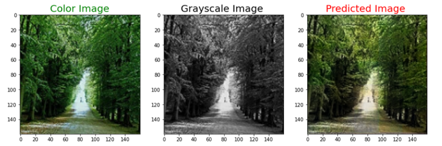
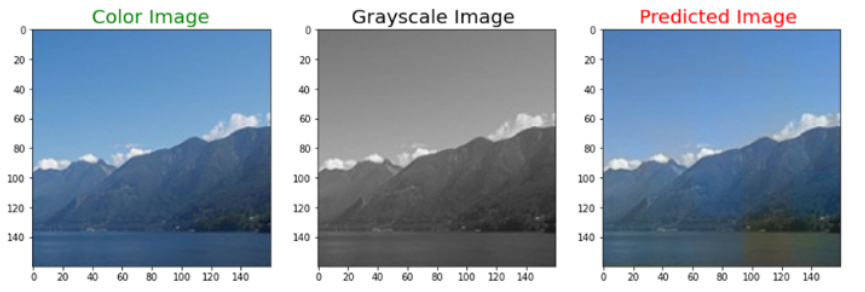
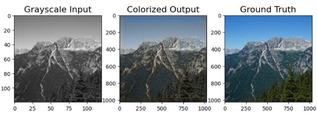
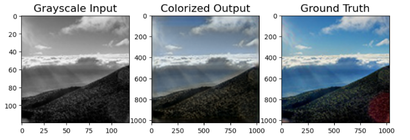

<h1 align="center">
  Image Colorization
 </h1> 

 Image Colorization is a deep learning project that aims to add color to grayscale images. This challenging task involves understanding the image's context and mapping the grayscale to corresponding color values.

 # Method

 Three different methods have been used:
  1. <b>Autoencoders:</b> It consists of an encoder and a decoder. The encoder transforms the input data into a lower-dimensional representation. The decoder recovers the image from the lower-dimensional representation and adds color.
  2. <b>Generative Adversarial Network:</b> It consists of the generator and discriminator models. The generator is trained to generate colorized images. The discriminator classifies the images generated as real or fake. The aim is for the generator to fool the discriminator.

# Results
1. <b>Autoencoders</b> 

  

  

3. <b>Generative Adversarial Network</b> 

  

  

